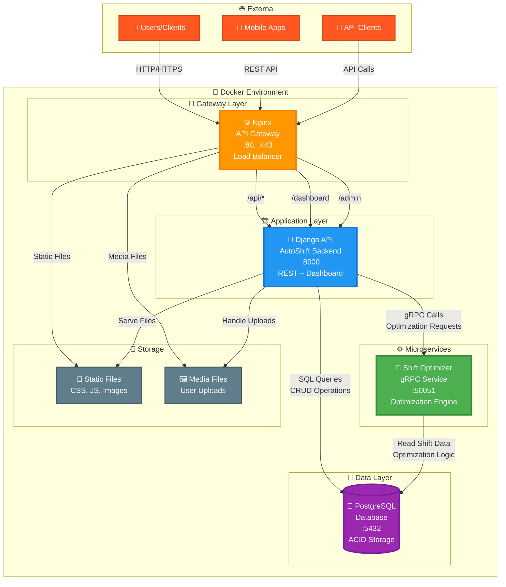

# AutoShift - Полная архитектура системы

## Схема взаимодействия сервисов (Production Ready)



## 🏗️ Архитектурные компоненты

### 1. **🌐 Nginx (API Gateway & Load Balancer)**
```
Порт: 80, 443
Функции:
├── Reverse Proxy для Django
├── SSL Termination (HTTPS)
├── Static Files Serving
├── Load Balancing
├── Rate Limiting
├── CORS Headers
└── Health Checks
```

### 2. **🐍 Django Application (Backend API)**
```
Порт: 8000 (internal)
Функции:
├── REST API Endpoints
├── JWT Authentication
├── Business Logic
├── gRPC Client Integration
├── Web Dashboard
├── Admin Interface
└── Database ORM
```

### 3. **⚙️ Shift Optimizer (gRPC Microservice)**
```
Порт: 50051
Функции:
├── Shift Optimization Algorithms
├── High-Performance Computing
├── Independent Scaling
├── Protocol Buffers
└── Async Processing
```

### 4. **🐘 PostgreSQL (Database)**
```
Порт: 5432
Функции:
├── User Management
├── Shift Scheduling Data
├── Warehouse Information
├── Cargo Management
├── ACID Transactions
└── Data Integrity
```

## 🔄 Потоки данных

### **HTTP Request Flow:**
1. **Client** → `HTTP/HTTPS` → **Nginx**
2. **Nginx** → `Proxy Pass` → **Django**
3. **Django** → `SQL` → **PostgreSQL**
4. **Django** → `gRPC` → **Shift Optimizer**
5. **Response** ← `JSON/HTML` ← **Client**

### **Optimization Flow:**
1. **User** → `POST /api/shifts/optimize/`
2. **Django** → `gRPC Call` → **Optimizer**
3. **Optimizer** → `Read Data` → **PostgreSQL**
4. **Optimizer** → `Algorithm` → **Optimized Schedule**
5. **Django** → `Update DB` → **PostgreSQL**

## 🐳 Docker Services

```yaml
services:
  nginx:           # API Gateway & Load Balancer
  app:             # Django Application
  shift_optimizer: # gRPC Optimization Service  
  db:              # PostgreSQL Database
```

## 📊 Технологический стек

| Компонент | Технология | Версия |
|-----------|------------|--------|
| **Gateway** | Nginx | Alpine |
| **Backend** | Django REST Framework | 5.1 |
| **Language** | Python | 3.12 |
| **Database** | PostgreSQL | 15 |
| **Microservice** | gRPC + Protocol Buffers | Latest |
| **Frontend** | Bootstrap + Chart.js | 5.3 |
| **Auth** | JWT (Simple JWT) | Latest |
| **Containerization** | Docker + Docker Compose | Latest |
| **API Docs** | Swagger/OpenAPI | 3.0 |

## 🚀 Преимущества архитектуры

### **Масштабируемость**
- Независимое масштабирование сервисов
- Горизонтальное масштабирование через Nginx
- Микросервисная архитектура

### **Надежность**
- Health checks для всех сервисов
- Graceful degradation
- Database connection pooling

### **Производительность**
- Nginx кэширование статических файлов
- gRPC для высокопроизводительных вычислений
- Database indexing и оптимизация

### **Безопасность**
- JWT аутентификация
- HTTPS через Nginx
- CORS политики
- SQL injection protection 