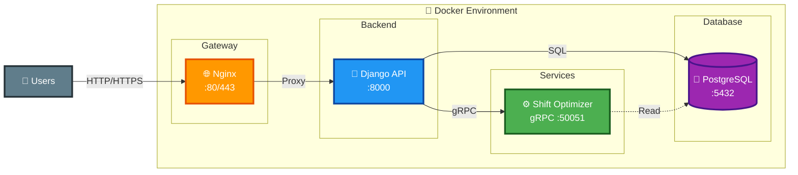

# Архитектура AutoShift - Слайд для презентации

## Схема взаимодействия сервисов

## Ключевые особенности архитектуры

### 🏗️ **Микросервисная архитектура**
- **API Gateway** (Nginx) - единая точка входа
- **Backend API** (Django) - основная бизнес-логика
- **Optimization Service** (gRPC) - независимый сервис оптимизации
- **Database** (PostgreSQL) - централизованное хранение данных

### 🐳 **Контейнеризация**
- Все сервисы изолированы в Docker контейнерах
- Простое развертывание через Docker Compose
- Масштабируемость и портируемость

### 🔄 **Взаимодействие сервисов**
- **HTTP/REST** - клиент-серверное взаимодействие
- **gRPC** - высокопроизводительная связь между сервисами
- **SQL** - работа с базой данных

### 📊 **Технологии**
- **Python 3.12** + Django REST Framework
- **gRPC** + Protocol Buffers
- **PostgreSQL 15**
- **Docker** + Docker Compose
- **Bootstrap 5** + Chart.js 